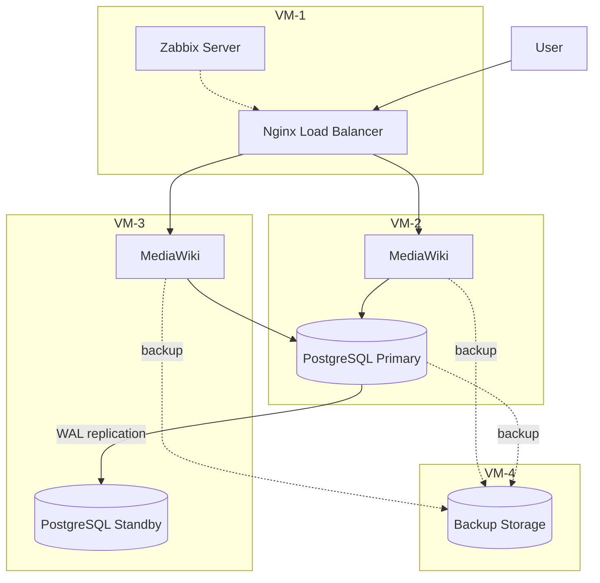

# Architecture
(Almost) Stable infrastructure for MediaWiki service

## Overview
4 Virtual Machines - Ubuntu-based
## Components
VM number 1 - Nginx load-balancing + Zabbix monitoring server
VM number 2 and 3 - MediaWiki+PostgreSQL
VM number 4 - backup data storage
## Data Flow
Client -> Internet -> Nginx -> MediaWiki -> PostgreSQL
PostgreSQL primary/standby replication using WAL
## Backup
Automated backups for service filesystem and database using bash scripts
## Monitoring
Zabbix availability monitoring via HTTP code and response time

## Architecture Diagram

